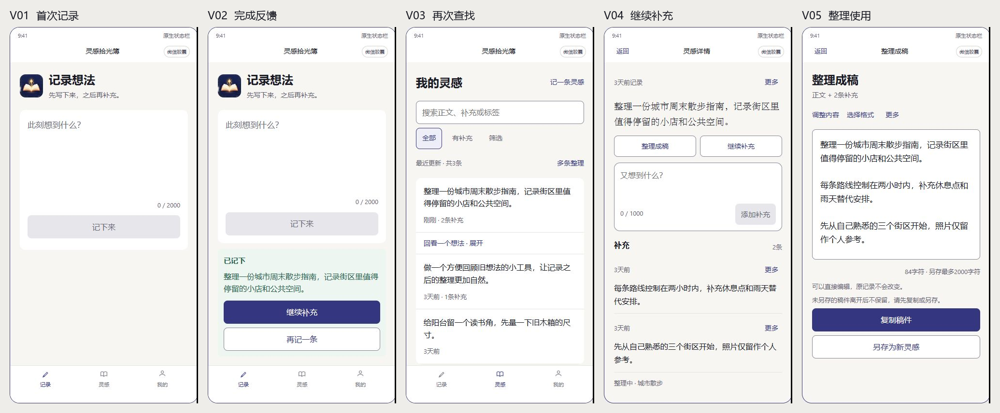

# 灵感拾光簿：当前版本体验审查与优化方案

日期：2026-10-01。对象：`dev/a6dd036` 加现有未提交修复。交付：[五页可点击设计原型](prototype.html) · [本轮16张实际页面截图](evidence/README.md)。本轮新增设计文件，未实施业务代码、未部署、未启用 AI、未提交或推送。

**阅读证据的方式**：O＝本轮模拟器页面/交互观察；S＝当前源码辅助核对；J＝设计判断；H＝需目标用户验证的假设。O 使用当前 WXML/WXSS 的隔离工程、合成内存数据，云与 AI 关闭；不能证明线上服务或真机可用。原始启动过渡页在隔离工程无法启动，副本改为直接进入记录页后完成页面审查，故冷启动/身份确认仍是证据缺口。详情见证据目录。本次不以旧报告中的问题代表当前问题。

## 1. 产品体验判断

### 主要用户、情境与价值

目标用户暂以**需要持续补充零散想法的个人**为基线：内容创作者、策划/产品人员、个人项目实践者。尚无访谈数据确认哪一类占主导【H】。产品适合通勤、聊天后随手写一句；数日后找到同一想法继续补充；需要使用时整理成可复制的文字。无团队协作证据，不扩为项目管理产品。

核心任务：**记下一句话 → 找回上下文 → 补充 → 整理并带走文字**。第一次最小价值仅需进入记录页、输入、点击“记下来”、看到明确确认。后续完整价值包括能找回、能接着写、能整理使用。当前 AI 关闭，热度能力暂缓【S】，因此首屏不能以 AI 效果或热度预测吸引用户；当前价值由记录、补充、找回和手动整理支撑。

五项目标的排序：**好用、会用最高；想用其次；愿意回来来自已有想法继续有用；愿意推荐来自清楚的“一句话可以持续补充，最后拿去使用”**【J】。这是产品任务排序，未量化用户需求。无需增加打卡、积分、榜单、弹窗或召回消息。

### 已有效的设计，应作为回归保护项

1. 记录页的标题、占位符和唯一保存按钮清楚；输入不要求标题、标签或用途，已移除空输入示例，保持当前用户决定。【O01—02】
2. 成功反馈包含本次内容摘录，以及“继续补充/再记一条”；没有强制跳详情。【O03】
3. 列表先呈现最近记录，轻量回顾在第一条之后；搜索无结果有明确清空出口。【O04、16】
4. 详情原文、继续操作、补充输入、补充时间线相邻；标签、照片靠后，不再挤走主任务。【O05—07】
5. 单条整理进入即有可编辑自由稿，复制与另存分开；手工编辑不改原记录。【O08；S content-output】
6. 不确定保存已有常驻说明，补充新增与稿件另存等待时已有冻结逻辑；页面菜单把危险项和日常操作区分。【O11、14；S】

### 核心障碍与优先改变的三件事

**当前需要增量修整，无须重做整体信息架构。** 最优先：

1. **保护所有编辑入口在等待回执时的输入。** 正文修改已复现 A 提交后仍能输入 B，确认返回后 B 被覆盖；同类补充修改需补验。【O12—13】
2. **统一保存与输入反馈。** 未确认状态只留一个重试主操作；补充输入也显示未保存风险；不把关闭/返回提示当成恢复能力。【O06、14；J】
3. **统一文字层级并缩短多条整理的前置判断。** 补充正文提升到16px下限，辅助13px；多条整理先选内容、直接形成自由稿，格式按需调整。【O10；原生测量；J】

## 2. 按优先级排序的问题与建议

影响 I：4＝内容损失/结果误判，3＝核心任务受阻，2＝重复摩擦，1＝品质。频率 F：4＝每次核心任务，3＝经常，2＝偶发，1＝边缘；频率为设计估计。证据 E：3＝交互/测量复现，2＝页面与源码，1＝假设。成本 C：1＝局部文案样式，2＝单页行为及回归，3＝跨页行为。按风险先行，再参考 `I×F×E/C`；分数不能把数据损失排到低风险后面。

| 编号 | 优先级 | 问题 | I/F/E/C | 成本与范围 |
| --- | --- | --- | --- | --- |
| R01 | P0 | 正文保存等待期间的新输入被确认版本覆盖 | 4/2/3/2 | 中；详情编辑状态与回归，同类入口核验 |
| R02 | P1 | 保存未知时同时出现“记下来/重试保存” | 3/2/3/1 | 小；记录页呈现和按钮状态 |
| R03 | P1 | 补充输入14px、时间/计数12px，局部字阶未统一 | 2/4/3/1 | 小至中；capture/detail与小屏回归 |
| R04 | P1 | 未保存补充缺少常驻说明，返回提醒覆盖有限 | 4/2/2/1 | 小；提示与生命周期核验，风险未有真机丢失证据 |
| R05 | P2 | 多条整理先展开格式和稿件风险，内容选择排后 | 2/2/2/2 | 中；选择页和成稿页顺序、取消保护 |
| R06 | P2 验证 | “选材整理”对首次用户的含义不确定 | 2/2/1/1 | 小；先测命名，再决定替换 |
| R07 | P1 验收门槛 | 冷启动、键盘、权限、真实服务尚缺证据 | 3/4/1/3 | 验证成本单列；证据缺口，不是已确认缺陷 |

### R01：正文修改等待期间，输入保护仍有缺口

- **页面/场景**：详情→更多→修改正文→保存修改；网络响应未返回时继续输入。【O12、13】
- **当前依据**：合成延迟确认：提交 A 后输入 B，界面接受 B，最终 `text/editDraft/saved` 均为 A。`.origin-editor` 无 `disabled`，`onEditInput` 无 pending 防护；补充修改也缺少对应保护【S】，但后者尚未复现，不写成已发生损失。
- **影响**：用户以为继续写的文字仍在，确认后却丢失；削弱对保存的信任。【J】
- **修改**：沿用已有效的新增补充/稿件另存模式：提交快照后，将**当前编辑器、保存、取消及会切换内容的操作**冻结；事件层拒绝等待期间的输入。按钮“保存中…”，编辑器下“正在保存，请稍候。”。正文与补充修改共用语义；失败恢复可编辑，保留提交文字。不要只锁按钮。
- **修改后流程**：编辑 A→保存中（A可读，不能写入B）→确认后退出编辑并显示A；未知/拒绝→A原样保留，提供重试或复制；相同逻辑重试保持原标识。若未来允许等待期间继续编辑，需完整保存 B 并区分“提交的A已保存/B尚未保存”，本轮推荐冻结以控制复杂度。
- **收益/代价**：防止已复现的输入覆盖；等待期间短暂不可编辑，需要明示状态。改动行为须先走对应 OpenSpec 提案，实施时不能改变幂等与账户边界。
- **验证**：手动释放5秒回执，尝试键入/粘贴 B、双击、取消、跳整理；B应无法进入输入或完整保留，不能无提示消失。失败后A逐字一致；已确认正文等于提交快照；旧页面/账户迟到响应不改新页面。模拟器与真实输入法分别验。
- **文件映射**：`pages/detail/index.wxml` 的原文和补充修改 textarea，`index.js` 的输入/提交/确认路径；现有 `tests/ui-interaction-repair.test.cjs` 增加有意义的延迟回归。不得直接改云函数副本。

### R02：结果未知，只留一个主操作

- **页面/场景**：记录→模拟NETWORK回执。【O14】
- **问题**：未确认文案已经正确，但上方“记下来”和下方“重试保存”都用主色。源码两者都调用同一保存路径；界面让人判断是否有两种保存方式。【O/S；用户是否困惑为H】
- **修改**：提示放在按钮上方；原主按钮就地变为“重试保存”，删除提示卡中的重复主按钮。保留一个次操作“复制内容”。未知、拒绝、成功用文字+状态符号区分。
- **界面内容**：标题“尚未确认保存”；说明“内容还在输入框中。退出前请重试保存或复制内容。”；主按钮“重试保存”；次按钮“复制内容”。明确拒绝用“未能保存”并只展示已知原因；不编造失败原因。
- **流程**：未知→同一逻辑请求重试→确认；编辑内容后退出旧未知态，撤下旧反馈。结果未知不能当成已保存，复制不能当成已保存。
- **收益/代价**：减少选择与误解；只改变呈现，协议保持。无数据证据时不声称转化提升。
- **验证**：新用户能指出唯一下一步；模拟“已写入但丢回执”时仍未知，重试只有一条记录；真实幂等需另行授权云环境测试。原型仅测理解与状态。
- **文件映射**：`pages/capture/index.wxml/.js/.wxss`；记录状态相关规范、文案定稿在后续实施时同步。

### R03：把补充当作主要内容，统一字阶

- **页面/场景**：记录、详情阅读/补充。原生测量：记录输入17px，计数12px；补充输入14px，时间线正文15px，详情时间12px，已测按钮高45px。【O，measurements.json】
- **问题/影响**：记录与成稿易读，持续补充反而更小；辅助文字尤其在小屏可能难辨。【J，未做视力/读屏研究】
- **修改**：补充输入和时间线正文 `max(30rpx,16px)`；时间、计数、风险说明 `max(26rpx,13px)`；提示文字14px下限；短原文19px、长原文17—19px，由行距控制可读性，不缩字以塞首屏。保留现有整体布局、品牌、细分隔线。输入边界采用既有 `#858596`，不要加深所有装饰线。
- **页面效果**：原文最大、补充正文其次、时间/来源/计数第三；输入区仍64px/160px两档，增字不裁切容器；扩展后的时间线正常纵向滚动。
- **收益/代价**：阅读与输入尺度一致；首屏可见行数可能减少，应接受正常滚动，不能以缩字抵消。
- **验证**：320/375/390/430px原生计算字号满足下限；字体1.3倍无裁切；正文对比度目标≥4.5:1，重要表单边界/非文字图形≥3:1；按钮热区≥44×44逻辑px。本轮仅测局部，未宣称全量可访问性通过。
- **文件映射**：`capture/index.wxss`、`detail/index.wxss`，必要时引用 `app.wxss` 字阶 token，核对局部覆盖不回退。

### R04：补充也要说清未保存状态

- **页面/场景**：详情输入补充、中断、系统手势离开。【O06】
- **依据**：输入后只有计数与添加按钮，没有记录页同类常驻风险说明；源码已有返回询问调用，保留。【S】官方说明手势返回不拦截，功能不得阻碍退出小程序。见 [返回询问官方说明](https://developers.weixin.qq.com/miniprogram/dev/api/ui/interaction/wx.enableAlertBeforeUnload.html)。
- **判断边界**：本轮没有复现真机丢失，也没有证明用户误把输入当成已存；这是风险沟通缺口【J/H】。
- **修改**：非空未提交时显示“尚未保存，退出后可能丢失。”；提交中替换为“正在保存，请稍候。”；确认后撤下。未知显示“尚未确认保存，内容仍在。请重试确认，或先复制。”及恢复动作。正文/补充修改也遵守同一规则，不仅新增补充。
- **流程**：输入→添加→等待冻结→确认清空；未知/拒绝保留输入；可提示的返回行为用户取消后保持逐字相同。导航到整理也先核对未提交内容；不能无提示将其计入稿件。
- **收益/代价**：清楚区分会话输入与已确认内容；输入区多一行13px说明，不加本机草稿、离线队列或自动弹窗召回。
- **验证**：提示只在对应状态显示；不能同时出现“尚未保存/已添加”；记录页与详情用词一致。iOS/Android真实返回取消、手势、隐藏/重进分别留证据，关闭时不承诺拦截或恢复。
- **文件映射**：`detail/index.wxml/.js`、相关失败复制出口；不修改存储架构。

### R05：多条整理先选内容，再选格式

- **页面/场景**：列表→选材整理，尚未选择任何文字。【O10】
- **问题**：五种格式先于素材；没有稿件时已出现“未另存的稿件离开后不保留”；搜索、工具行紧贴，首屏真实素材少。【O/J】
- **修改**：标题与一句用途→搜索→素材列表→底部“已选N段 · M条灵感 / 整理成稿”。默认自由稿，五种格式移到成稿页“选择格式”，保持原有能力。未另存提示只在已有稿件时出现；不要对选择阶段报不存在稿件的风险。工具行上下留8px。
- **稿件生成后**：顶部显示来源条数与段数→可编辑稿→复制稿件/另存为新灵感；次入口“返回选材/选择格式”。返回选材保留选择顺序和当前稿件；重新生成若手工改过，先确认替换，取消保留当前稿件。沿用40段/20条来源/12000字符边界，另存2000字符上限，不暗改数量。
- **收益/代价**：用户先决定“用什么”，再决定“怎么组织”；明确需要模板的人多一次点选。需改变页面状态，后续先补提案；不能通过默认全选来省选择，因为无法判断用户想用哪些。
- **验证**：首次进入首屏能看到至少两段短素材或第二段开头；格式无需选择也能生成；同一素材选择/取消不重复；数字对应进入稿件的顺序。对已有编辑稿件取消替换，文字、选择及格式不变。用目标用户比较“先格式/后格式”的犹豫次数，再决定保留。
- **文件映射**：`material-output/index.js/.wxml/.wxss`；`content-output.js` 与 `material-output.js` 的拼接规则保持现状；如修改 core/server 才需重建云副本，设计阶段不触发。

### R06：验证“选材整理”命名

- **场景/依据**：列表段落头的“选材整理”没有行内说明；进去后副标题才解释多条用途。【O04、10】
- **假设**：非创作者可能把“选材”理解为选照片或外部资料【H】，本轮未证实。
- **方案候选**：“多条整理”与现有“选材整理”做不提示用途的理解测试。原型展示前者；进入后副标题保持“从多条灵感中选择内容，整理成一份稿件。”。单条继续叫“整理成稿”，术语“灵感/补充/稿件”不另造同义词。
- **收益/代价/验证**：可能提升发现；修改成本小但现有用户习惯需考虑。每组至少5名目标用户，问“点击后会做什么”，先理解再操作，比较回答与首击。不以视觉偏好替代命名理解。

### R07：平台与服务验证清单

这项是交付门槛：冷启动等待/失败→能进入输入；真实保存、弱网丢回执、身份切换；中文候选栏、点击继续补充一次聚焦；完整安全区、小屏、字号放大与读屏；照片权限拒绝、上传失败与删除清理；从分享/扫码直接进入可读内容或恢复页。上述未完成不代表功能不能使用，须收集实际证据再判断。当前照片未在本轮开放、AI关闭，不展示不可用入口或把未来能力当价值承诺。

## 3. 优化前后的核心用户流程

| 任务 | 当前已观察流程 | 本轮优化后的流程 |
| --- | --- | --- |
| 首次记录 | 记录页→输入→记下来→摘录成功卡→继续补充/再记 | 保留；未知时原按钮变为“重试保存”，次操作复制，无重复主按钮 |
| 找回并补充 | 列表搜索→详情→补充→添加→数量/时间线更新 | 保留；输入与风险说明统一，等待冻结，确认反馈对应新增内容 |
| 修改正文 | 更多→修改→保存等待仍能输入B→确认A覆盖B | 更多→修改A→保存冻结→确认显示A；失败仍保留A并可恢复 |
| 单条整理 | 详情→直接自由稿→编辑→复制/另存 | 保留；补齐返回风险与状态一致，不重新引入格式必选 |
| 多条整理 | 选材整理→五种格式/风险说明→选内容→生成→编辑取用 | 多条整理→选内容→直接自由稿→需要时选格式→编辑→复制/另存 |
| 再次进入 | 首次路由账户读取→进入记录；列表查看已确认内容 | 流程保持；冷启动与读取失败需真实验证，不新增强制首页或每日提醒 |

第一次得到价值仍为“输入一次＋保存一次＋确认一次”，不因改版多出分类、用途选择或授权步骤。长期价值由同一条灵感的原文和时间线延续；结果是可以复制使用的文字。

## 4. 两个视觉方向及推荐理由

| 维度 | A 纸页与靛墨（推荐） | B 清晰工作台 |
| --- | --- | --- |
| 气质/用途 | 个人笔记，适合从一句话逐渐补全；强调文字、连续阅读 | 素材工作区，适合频繁搜索与多条拼接；强调来源与扫描 |
| 配色 | 暖纸 #F7F6F2，白承载，深靛 #34377F；少量已有金色品牌 | 冷灰 #F3F6FA，白承载，蓝 #2459BA，深蓝文字 #172033 |
| 字体 | UI系统无衬线，原文19px可用系统衬线回退；补充/编辑统一16—17px | 全系统无衬线；原文18px600、正文16px400、来源13px |
| 布局 | 连续原文/时间线、轻分隔、12px承载圆角，输入留呼吸空间 | 来源/数量与正文更紧凑对齐、8px段内间距、6px圆角，少量连续表格式行 |
| 显著差别 | 读写优先，原文与后续思考的层级明确 | 查找/选材优先，材料来源更显著；不是只换主色 |
| 取舍 | 延续现有品牌与实现，降低修改成本；Android衬线效果需评估 | 更像工具，可读效率高；可能弱化个人记录气质，需偏好测试 |

推荐 A：当前优势已经建立在暖纸、靛色、原文与时间线。当前关键问题主要来自状态和局部尺度，换整体皮肤收益不明确。保留现有书页标识，不增加插画、贴纸或背景纹理。B作为测试备选；原型先演示配色、字族、圆角，正式选B后才制作其完整来源列/材料布局，不能把换色演示当作完整B交互验证。

## 5. 推荐方案的关键页面视觉稿与原型

[打开五页可点击原型](prototype.html)。可切换A/B、320/375/390/430px稿面宽度、单页体验、保存与列表状态。合成保存、补充、编辑保护、搜索、选材、内容调整、格式替换和另存可操作；复制为状态模拟。未执行微信授权、剪贴板写入、文件生成、分享发送或云写入。

| 页面/状态 | 布局与主要文案 | 交互与开发规格 |
| --- | --- | --- |
| V01 首次记录/未知 | 品牌48px+标题24px；副标题14px；白色输入承载、输入17px；计数13px；唯一48px主按钮 | 空输入禁用；不自动弹键盘、不新增示例。保存等待禁用编辑；未知提示在按钮前，原位“重试保存”+复制内容。成功摘录对应确认内容 |
| V02 完成反馈 | 同一记录页状态：成功标记+“已记下”+两行摘录；“继续补充/再记一条” | 单独稿面用于审阅，实际不导航到独立成功页。前者正确ID详情并聚焦；后者空输入。开始新记录清掉旧成功反馈 |
| V03 再次查找 | 标题+右侧记录入口；搜索；全部/有补充/筛选；最近数量+多条整理；连续列表 | 回顾第一条之后，点开才显示。不足两条不占位；真空态只显示开始入口；无匹配保留筛选并提供一键清空；更新失败保留同账户已读内容 |
| V04 核心补充/修改 | 时间/更多→完整原文→两任务按钮→补充输入→时间线→标签→照片 | 64px/160px输入，正文16px、计数13px；非空未保存提示。新增及修改等待同样冻结。原文长时保留既有一键定位补充；键盘打开隐藏浮动按钮 |
| V05 整理与取用 | 来源摘要→调整内容/选择格式/更多→270px编辑器→计数与风险→复制/另存 | 进入默认自由稿；格式变化替换手工编辑前确认，取消保持原字。另存超过2000字符禁用但可复制；另存确认后查看正确新记录；复制成功不改变另存状态 |

多条选择状态不再新造第六套视觉：复用V03连续内容行和V05稿件区。选择行左24px序号、右侧来源13px/正文16px，整行44px以上热区，底部48px按钮加安全区。选中使用勾选或序号+边框/浅底，不能只改色。格式移到结果页，选择顺序和原稿保留。

体验亮点限制为三个，来自现有价值：

| 亮点 | 解决的问题/何时感到 | 学习与维护成本 |
| --- | --- | --- |
| 一句话，接着写 | 输入后不需要分类；回来看到原文和自己的思考时间线 | 已有能力；补齐状态和字号，无新概念 |
| 回看一个想法 | 没有明确查找目标时，轻量捞起旧内容继续想 | 已有入口；本次先不看，仅会话有效，不自动推送 |
| 拿走可编辑稿 | 有使用目的时，直接看到自己文字形成的稿件，再按需调格式 | 已有规则；减少前置选项。模板不补事实、不称AI生成 |

## 6. 统一视觉规范与关键交互说明

### 颜色、字阶和组件

单位约定：**px＝逻辑/CSS像素，rpx＝以750宽设计稿换算**。布局边距随宽度适配，字与点击区设px下限。`max()`不支持时必须有基础px回退，不能仅回退小rpx；支持范围以目标基础库真实渲染核对。宽度320—430px，不以缩字挤完所有内容。

| Token | 值 | 使用规则 |
| --- | --- | --- |
| 页面底 | #F7F6F2 | 所有普通页面；原生导航白底 |
| 内容承载 | #FFFFFF | 输入、连续列表、弹层；不让每条补充独立浮起 |
| 正文/次级/辅助 | #191A23 / #5F6070 / #6F6F7B | 正文、说明、时间计数；辅助≥13px |
| 主色/浅底 | #34377F / #EEEEF8 | 主按钮、链接、选中；选中必须同时有文字/符号 |
| 分隔/表单边界 | #E6E4DE / #858596 | 装饰分隔弱；关键输入边界强，现有field token沿用 |
| 成功 | #24604B / #EDF6F0 | 明确成功文字与成功符号，不用成功色表达尚未确认 |
| 未确认/等待 | #805B1F / #FDF4E3 | 未确认使用警示文字+恢复动作；等待用正在…，不暗示失败 |
| 错误/危险 | #B43C32 / #FBEEEC | 已知错误/删除；标题+原因+恢复；不只靠红色 |
| 品牌金 | #E4A83A | 仅现有标识或少量品牌点缀；不用在白底作小字 |

静态计算对比度见本轮 `contrast.json`；最终仍以实际背景、透明度和字重核对。禁用按钮可弱化，但未保存风险与可恢复入口必须达到正文可读目标。

| 元素 | 尺度及规则 |
| --- | --- |
| 页面标题 | 24px/600/1.3；普通二级标题18px/600；避免所有标题加重 |
| 原文 | 19px/400/1.7；系统衬线可回退；编辑器优先稳定系统无衬线 |
| 正文/输入/稿件 | 16—17px/400/1.65—1.75；固定输入视口内滚动，长文本换行；不无提示截断 |
| 按钮/说明/元信息 | 主按钮16px500；次按钮14—16px500；说明14px；元信息13px |
| 间距 | 4/8/12/16/20/24/32px标尺；页面左右40rpx（约17—23px）；组件内12—16px；区块20—24px；文字与对应操作8px |
| 圆角 | 主按钮8px；输入/内容承载10—12px；弹层上角16px；标签4px；同类共用，不随页面任意变化 |
| 按钮 | 主动作48px高，全部热区≥44×44px；每个任务区域一个主按钮；等待字样并禁用重复提交；次动作描边/文字 |
| 表单 | 白底，1px field边界；占位符不能替代必要标签；计数和错误在输入附近；maxlength=-1收全文，提交层上限校验；空输入、超限、等待分别禁用 |
| 列表 | 正文最多2行摘录、时间/补充同行；标签最多2个；整行可点；1px装饰线；不可交互的摘要不假装按钮 |
| 图标 | 沿用现有tabBar资产和统一图标体系，视觉20—24px/热区44px；错误/选中/成功有文字；装饰图不抢正文 |
| 状态反馈 | 输入附近常驻；确认成功才清输入。瞬时复制反馈可用toast，但恢复操作不只放toast；错误后保持上下文 |

### 小程序交互边界

1. **导航与安全区**：继续使用原生导航/胶囊。自绘浮动操作避开胶囊和返回区；非tab页面底部操作与系统区域之间至少8—12px+实际安全 inset。tabBar已占用安全区时不重复加。`getWindowInfo.safeArea`可能缺失，需0回退及目标机型验证，不能把屏幕inset盲目扣到内容窗口。见 [官方窗口信息](https://developers.weixin.qq.com/miniprogram/dev/api/base/system/wx.getWindowInfo.html)。
2. **键盘**：普通进入不自动聚焦；点继续补充才请求`focus`。初始沿用`adjust-position=true`、`cursor-spacing=24`逻辑px；避免叠加两套上推。固定64/160px输入不启用auto-height，auto-height启用时固定height不生效。真机检查中文候选栏、末行光标与提交动作可达。见 [textarea官方文档](https://developers.weixin.qq.com/miniprogram/dev/component/textarea.html)。
3. **保存**：尚未提交→进行中→确认/未知/拒绝；同一提交冻结、幂等重试、迟到响应校验账户/页面。写入前后的成功、失败、进行中文字互斥。未知不确认失败也不生成列表里的待同步条目。
4. **替换/返回/取消**：取消不改变输入、材料、格式。手工改稿换模板先确认替换。返回询问仅覆盖官方支持的情境，不能承诺手势、关闭、系统回收后恢复；持续风险文案仍必要。无导航栈的缺失记录页用明确“返回灵感列表”，不只navigateBack。
5. **分享/扫码**：先展示只读分享内容、来源产品与快照说明；之后“记录我的想法”。网络失败有重试；失效不猜撤销/到期，提示联系分享者并给开始入口。分享准备完成仅能叫“已准备”，不能叫“已发送”；好友选择由用户通过`open-type="share"`触发。Page中好友分享与朋友圈回调分别定义，不能用同一个按钮承诺任意平台发送。见 [Page官方分享回调](https://developers.weixin.qq.com/miniprogram/dev/reference/api/Page.html)。本轮没创建实际分享。
6. **登录/授权/订阅**：不增加手机号/头像登录墙。照片在用户点击添加时才按真实平台能力申请；拒绝仍可记录文字，并给“继续记录文字”，需要时用户主动打开设置。照片上传/删除/清理另验。无任务相关消息需求，本方案不添加订阅提醒；未来若使用，需在用户动作触发且用户同意后调用，不承诺可自动获得订阅。见 [订阅消息官方接口](https://developers.weixin.qq.com/miniprogram/dev/api/open-api/subscribe-message/wx.requestSubscribeMessage.html)。

### 状态覆盖矩阵

| 状态 | 规格 | 本轮证据状态 |
| --- | --- | --- |
| 首次进入 | 可直接写；无示例/分类必填；账户读取失败仍有输入出口 | 记录页O；真实启动未验 |
| 空列表 | 标题+空态+记下第一个想法；不显示无对象控件 | 当前源码S；原型模拟已覆盖 |
| 加载 | 明确正在读取，能保留当前已确认上下文时不清空 | S；原型模拟 |
| 成功 | 摘录/ID对应确认内容；可继续或修改 | O03、07；合成确认 |
| 明确拒绝 | 已知原因、保留输入、恢复按钮 | S；原型模拟 |
| 弱网/结果未知 | 未确认文案、同请求重试、复制保全 | O14；NETWORK注入，云端未验 |
| 刷新失败 | 同账户已有内容保留，轻提示+重试；首次失败不说没数据 | S；原型模拟 |
| 权限拒绝 | 继续文字任务；相应功能解释与用户主动恢复 | 本轮未验照片权限，后续真机 |
| 内容较多 | 原文完整、时间线滚动，输入和选材区域独立滚动；底部可达 | 当前短样例O；长文/100条矩阵待验 |
| 分享深链失效/空栈 | 当前内容可理解；明确重试/回列表/记录自己的想法 | S；真实分享、扫码待验 |

## 7. 分阶段实施建议

**第一阶段：信任与恢复。** 先R01，补齐正文和补充修改等待保护；同批R02、R04统一状态。行为变化先走提案；只做页面层必要修改，保留原始未提交改动与已通过模式。完成源码检查、延迟行为回归、模拟器状态截图后，再进行真实服务与两端真机验收。

**第二阶段：阅读与前置决策。** R03统一局部字阶/输入边界；R05调整多条整理顺序。用短文本、最大长度、100素材、1.3倍字号、小屏和长面板验收。R06先命名测试，若结果无明显理解差异就保留现有名称。

**第三阶段：真实用户验证与视觉定稿。** 用目标用户比较A/B和核心任务；只有发现稳定问题才继续改布局。之后再安排部署、发布与合并。报告中的拟议界面不能直接覆盖既有已实现设计文档；实施时按文档地图更新相关规范、详细设计、UI设计及spec-coverage。

**暂不做**：AI启用、热度评分、提醒/积分/打卡、团队协作、本机持久草稿/离线队列、欢迎教程、重画品牌、扩大模板数量、统一改成浮起卡片。没有验证收益时不扩大范围。当前删除确认无可靠恢复机制，不以“撤销”文字承诺不存在的能力。

实施检查仍按仓库约定：`npm test`、`npm run check`；行为规范变更加OpenSpec严格校验；core/server修改才同步云副本。每条场景有对应证据后才勾覆盖状态，测试通过不等于真机/线上确认。

## 8. 验收与用户测试方案

### 设计检查与交互验收

| AC | 固定验证任务 | 通过标准 |
| --- | --- | --- |
| AC01 输入保护 | 修改A→延迟5秒→尝试输入/粘贴B→确认/失败 | 等待期间B不能进入或完整保留；确认数据=A；失败A逐字保留；所有修改入口一致；不出现静默覆盖 |
| AC02 保存理解 | 输入→UNKNOWN→查看下一步→重试 | 只有一个重试主操作；内容原样保留；不能报已存/确定失败；云端同逻辑请求重试唯一性另测 |
| AC03 补充状态 | 未提交→等待→确认/未知/拒绝 | 风险/进行中/成功互斥；确认前不插入已确认时间线；失败有重试/复制方式 |
| AC04 文字与热区 | 320/375/390/430、字体1.3倍 | 正文/补充≥16px、元信息≥13px；关键热区≥44px；无裁字、横向溢出、操作遮挡；对比度按实际背景计算 |
| AC05 多条整理 | 选择3段→生成→改稿→调格式→取消替换 | 默认自由稿可成稿；材料顺序一致；取消后原稿逐字相同；选择阶段无不存在稿件的风险说明 |
| AC06 成功对应 | 保存内容X→继续补充；另存Y→查看新灵感 | 打开的ID与确认内容正确；编辑后撤旧成功；复制不解除未另存风险 |
| AC07 查找恢复 | 搜索补充关键词→详情→返回；刷新失败 | 匹配可解释、返回保持查询和位置；同账户保留已确认内容；身份变化清旧内容，迟到回执不能回填 |
| AC08 平台场景 | 键盘、弱网、权限拒绝、空栈深链、关闭重进 | 两端分别记录；主任务仍可继续；无无效重试/空栈返回；关闭不承诺未确认输入恢复 |

### 真实用户任务

先招募5—8名确有持续补充想法需求的人，兼顾创作者与普通个人记录者；用户类型判断属于假设，可在访谈后调整。先让他们使用当前版，再用优化原型；视觉方向顺序交替，避免先看A造成偏好。样本用于发现问题，不能估计总体转化或留存。

| 任务 | 记录方式 | 暂定成功标准/基线要求 |
| --- | --- | --- |
| T01 看首页后说用途，找到开始入口 | 不解释，10秒后复述；首击和停顿 | 5人中≥4人说出“记想法并后续补充”，都能找到输入/保存；阈值为拟定目标，需先测现状 |
| T02 记录一句话并判断是否已保存 | 不教按钮；记录犹豫/求助/误触 | ≥4/5独立完成；不得把UNKNOWN判断为确认成功；用时/点击数先测基线再定改善幅度 |
| T03 找回一条含补充的灵感并补新内容 | 20条固定数据，原文/补充/标签三种线索 | ≥4/5无求助完成；输入损失与错误记录0次；查找用时先测基线 |
| T04 整理并带走文字 | 单条和跨3段；要求修改后取消替换 | ≥4/5完成且能解释复制/另存差别；取消替换无文字变化；步骤/犹豫次数先测现状 |
| T05 弱网与中断 | 模拟等待/丢回执、展示离开提示 | 全部能指出内容尚未确认、选择重试或复制；错误理解可作为阻断缺陷，不当成个体失误 |
| T06 视觉与命名比较 | A/B随机顺序；选材整理/多条整理理解后首击 | 记录具体原因：字是否易读、操作是否容易找、个人记录/素材工具定位；不预设A必须胜出 |

对每次测试记录：任务结果、耗时、错误首击、回退、求助、输入损失、用户原话；将事实与设计师解释分列。若2名以上用户在同一点卡住，回到设计调整再测。不要将5人的4/5解释成正式上线80%转化。

### 结论分层

- **设计检查**：本轮已完成当前16张页面截图观察、局部字号/尺寸测量、正文编辑延迟输入覆盖复现与官方能力核对。启动路由、权限、真实服务、真机/读屏未通过验收，因为缺少证据。
- **原型检查**：五页与状态可供点击和评审；浏览器检查记录见 `evidence/prototype-checks.json`，具体通过项以该文件为准。复制/保存为模拟，不能证明平台行为。
- **本地基线检查**：现有 `npm test` 437/437、`npm run check` 261项、OpenSpec严格校验9/9通过。正文修改延迟输入覆盖已在模拟器复现，但既有测试没有挡住；本轮没有业务修复，不能将通过数用于撤下R01。
- **真实用户验证**：尚未开展，目标用户/命名理解/视觉偏好/操作效率仍为假设。没有上线数据，不报告转化率、留存率或推荐率提升。

本轮交付为审查和设计方案；现有业务修复与本轮设计文件均尚未提交，后续实施、云部署、测试验收和发布分别安排。
